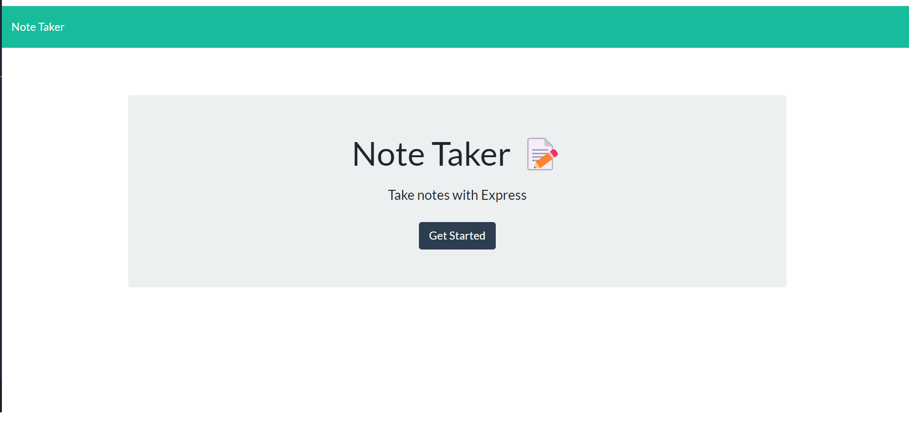

# Business-Task-Manager

## Description

Transitioning toward back end programming and the logical step would be to dip our toes in with Express.js before making the full leap into database-building. Using Express and the file system to act as a stand-in database, I was tasked with building out a task management/ note taking application that will take in new tasks, save them, retrieve them as needed, and for this data to be persistent.

## Installation

There is no installation needed. Simply [click here](https://ancient-earth-22514.herokuapp.com/) to see the work in progress. 

## Usage

Upon load (using the link above), you simply need to click on the "Get Started" button to be taken to the form fields. Here is a photo of the landing page for reference:

